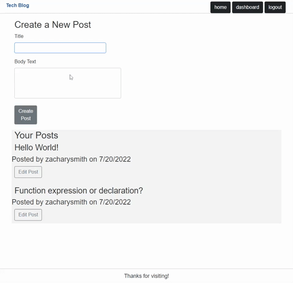
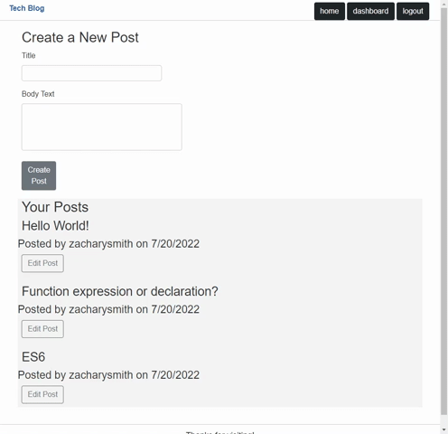

# Tech-Blog

## Table-of-Contents

- [Description](#description)
- [Deployed Site](#deployed-site)
- [Features](#features)
- [Technologies](#technologies)
- [Future Development](#future-development)
- [Credits](#credits)

## Description

This is my fourteenth challenge assignment for the University of Oregon Coding Bootcamp 2022. In this challenge, I use Sequelize, Express.js, and Handlebars.js to build a fullstack application that follows the MVC Paradigm. Users can create posts, edit posts, and comment on other's posts in this wordpress-type website.

## Deployed Site

Follow [this link](https://secret-lowlands-95047.herokuapp.com/) to view and use my site!

## Features

This is how the front-end webpage appears to new viewers. It is responsive, adapting to multiple screen sizes. The links in the navigation bar show buttons for "home," a page that shows the most recent posts by users on the site, and "login," where users can go to either login with their existing credentials or sign up as a new user. The posts on the homepage show details such as the title, date created, and post author.

To login or sign up, users must click the "login" button in the navigation bar. This brings them to a page where they can either enter their existing username and password to log in, or they can enter their username, email, and password to sign up for the site. Once they complete either the login or signup form, the user is brought to their dashboard. Signed-in users can see new buttons in the navbar - one for their dashboard, and one to logout. Clicking the logout button will sign the user out of the site, making the dashboard page unavailable again. 

On the user's dashboard, they can view posts that they have created. There is also a form in which users can enter a title and text body to create a new blog post. After they submit hte form, the page redirects to show an updated dashboard displaying their new blog post.

 

The user's dashboard isn't just for viewing and creating posts, it is also a place where users can manage their posts. By clicking on the "edit post" button under one of their existing posts, users can edit the contents of that post. Clicking "save post" will redirect the user to an updated dashboard showing their updated post. Alternatively, if users select the "delete post" button, the page will redirect to an updated dashboard showing that the post has been removed.

 

The homepage works a little differently than the user's dashboard. Here, users can view posts from other users. Each post lists the title, date created, and author of the post. If users click on the "view full post" button, they will be directed to that post's page. Here, users can view the full text contents of the post, as well as add any comments using the comment form. Users must be logged in to create a comment on a post. Once they submit their comment, the page is automatically redirected to an updated page showing the post and their new comment.

 

## Technologies

- [Handlebars.js](https://handlebarsjs.com/)
- CSS
- JavaScript
- Node.js
- npm
- [Express.js](https://expressjs.com/)
- [MySQL2](https://www.npmjs.com/package/mysql2)
- [Sequelize.js](https://sequelize.org/)
- [dotenv](https://www.npmjs.com/package/dotenv)
- [bcrypt](https://www.npmjs.com/package/bcrypt)
- [express-session](https://www.npmjs.com/package/express-session)
- [connect-session-sequelize](https://www.npmjs.com/package/express-session-sequelize)
- [faker.js](https://fakerjs.dev/)

## Future Development

In the future, I would like to add the following improvements:

- I would like to restyle this site to feature a cleaner and more readable user interface.
- This application is missing a "profile page" feature. Future users could click on a username to be brought to a profile page that features that user's posts and comments.
- I would also like to add functionality where users can add friends.
- A search function for this site is missing. Users should be able to search for posts with a freeform search, such as by keyword or username. A filtration system could work as well if users wanted to search for posts in the last 24 hours.

I'm always interested in refactoring code to improve it's functionality. If you would like to suggest your own improvements, you can reach me at the links below.

- <a href="mailto:ashleylynnsmith.dev@gmail.com">Email</a>
- <a href="https://github.com/ashlynn4567">GitHub</a>
- <a href="https://www.linkedin.com/in/ashley-lynn-smith/">LinkedIn</a>

## Credits

This project was built with the help of the University of Oregon's Coding Boot Camp.

## Licensing

The application is covered under the following license: [MIT](https://opensource.org/licenses/MIT)
