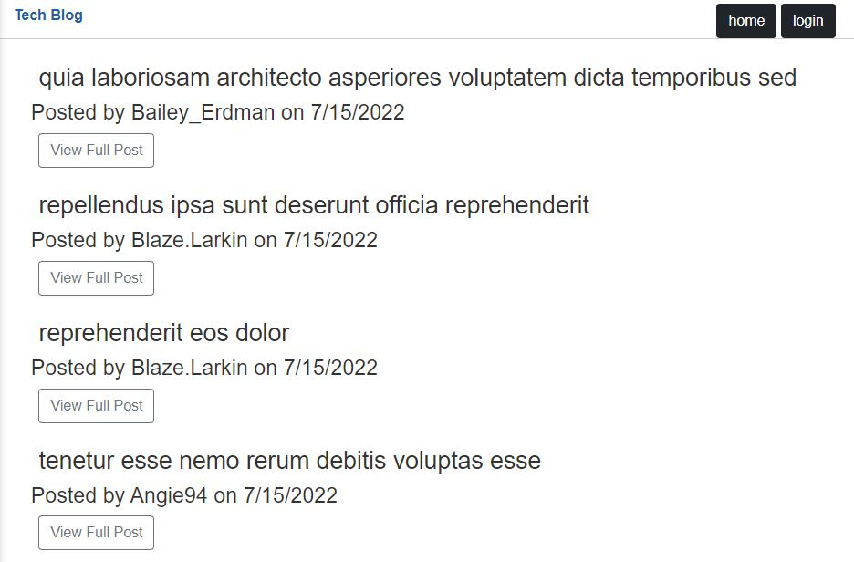
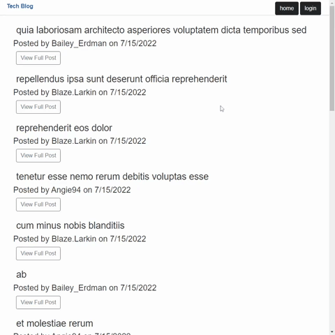

# Tech-Blog

[](https://opensource.org/licenses/MIT)

## Table-of-Contents

- [Description](#description)
- [Deployed Site](#deployed-site)
- [Features](#features)
- [Installation](#installation)
- [Technologies](#technologies)
- [Future Development](#future-development)
- [Credits](#credits)

## Description

This is my fourteenth challenge assignment for the University of Oregon Coding Bootcamp 2022. In this challenge, I use Sequelize, Express.js, and Handlebars.js to build a fullstack application that follows the MVC Paradigm. Users can create posts, edit posts, and comment on other's posts in this wordpress-type website.

## Deployed Site

Follow [this link]([insert later]) to view and use our site!

## To-Do:

- CSS Stylesheets and Handlebars adjustments
- Utilizing more backend routes on the front-end
- Finish Readme
- Turn in Project

## Features

### Front-End Demonstration

This is how the front-end webpage appears to viewers. It is responsive, adapting to multiple screen sizes.

<p align="center">

</p>

[insert later]

<p align="center">

</p>

[insert later]

<p align="center">
 
</p>

### Back-End Demonstration

To see all of the back-end functionality separate from the deployed page, you need to install it to your local machine. For instructions on how to do so, please see the [Installation](#installation) section.

1. GET request to the api endpoint `localhost:3001/api/[insert later]`
2. GET request to the api endpoint `localhost:3001/api/[inser later]/[insert later]`

<p align="center">

</p>

3. POST request to the api endpoint `localhost:3001/api/[insert later]/`.

```
[insert later]
```

4. PUT request to the api endpoint `localhost:3001/api/[insert later]/[insert later]`

```
[insert later]
```

5. DELETE request to the api endpoint `localhost:3001/api/[insert later]/[insert later]`

<p align="center">

</p>

## Installation

Although this application is deployed to a website, the front-end does not utilize all of the api's functionality. If you wish to view or test the routes, you can also install it to your local computer.

1. Open the command line interface.
2. Clone the repository onto your local machine using the `git clone` command.
3. Once the repository has been cloned, navigate into the root directory of the application using the command `cd Pizza-Hunt`.
4. Run the command `npm install` to install necessary packages and dependencies.
5. This application relies on private enviromental variables. In the main directory of the application, create a `.env` file.

- The contents of your `.env` file should look like this, where [MySQL username] is your MySQL username, and [MySQL password] is your MySQL password:

```
DB_NAME="tech_blog_db"
DB_USER="[MySQL username]"
DB_PW="[MySQL password]"
```

- For example, if my username is `ashlynn4567` and my password is `password1234`, my `.env` file will look like the following:

```
DB_NAME="tech_blog_db"
DB_USER="ashlynn4567"
DB_PW="password1234"
```

6. Next, you will need to seed the data. Note: You must have MySQL installed on your computer in order to seed the data.

- Log in to MySQL in your command line with the command `mysql -u root -p`.
- Enter your login credentials.
- Type the command `source db/schema.sql`. This creates the schema for your database.
- Quit MySQL with the command `quit`.
- In the root directory of the application, enter the command `npm run seed` into your terminal. This will finish seeding your database based off of the models.

5. Once the dependencies have been properly installed and your database has been seeded, enter the command `npm start` to initiate the application and start the connection to the database.

For further help with installation, please refer to the below demonstration video.

<p align="center">

<br>Here's a <a href="[insert later]" target="_blank">link</a> to the video version of the above gif.
</p>

## Technologies

- [Handlebars.js](https://handlebarsjs.com/)
- CSS
- JavaScript
- Node.js
- npm
- [Express.js](https://expressjs.com/)
- [MySQL2](https://www.npmjs.com/package/mysql2)
- [Sequelize.js](https://sequelize.org/)
- [dotenv](https://www.npmjs.com/package/dotenv)
- [bcrypt](https://www.npmjs.com/package/bcrypt)
- [express-session](https://www.npmjs.com/package/express-session)
- [connect-session-sequelize](https://www.npmjs.com/package/express-session-sequelize)
- [faker.js](https://fakerjs.dev/)

## Future Development

In the future, I would like to add the following improvements:

- [insert later]

I'm always interested in refactoring code to improve it's functionality. If you would like to suggest your own improvements, you can reach our development team at the links below.

- <a href="mailto:ashlynn4567@gmail.com">Email</a>
- <a href="https://github.com/ashlynn4567">GitHub</a>
- <a href="https://www.linkedin.com/in/ashley-lynn-smith/">LinkedIn</a>

## Credits

This project was built with the help of the University of Oregon's Coding Boot Camp.

## Licensing

The application is covered under the following license: [MIT](https://opensource.org/licenses/MIT)
